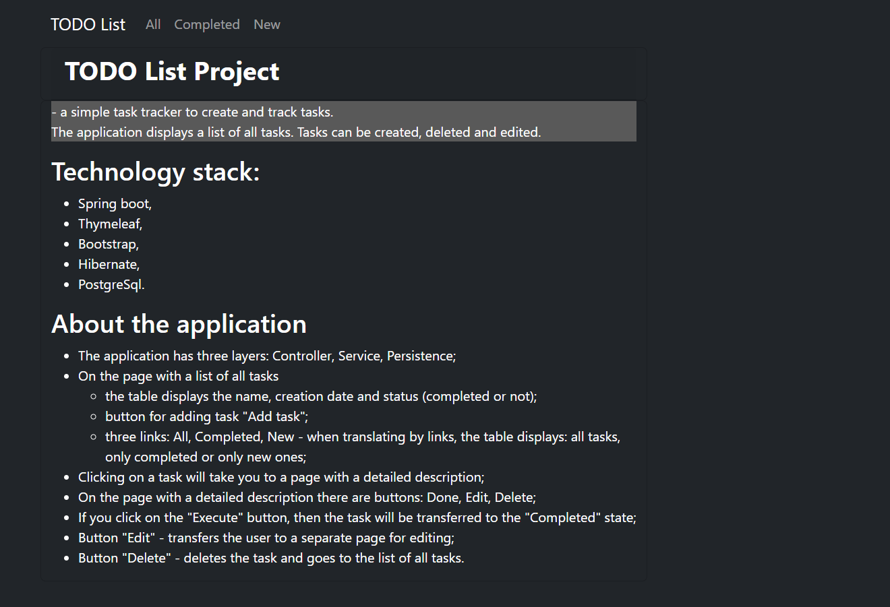
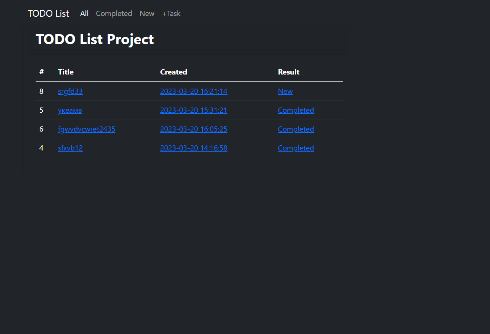
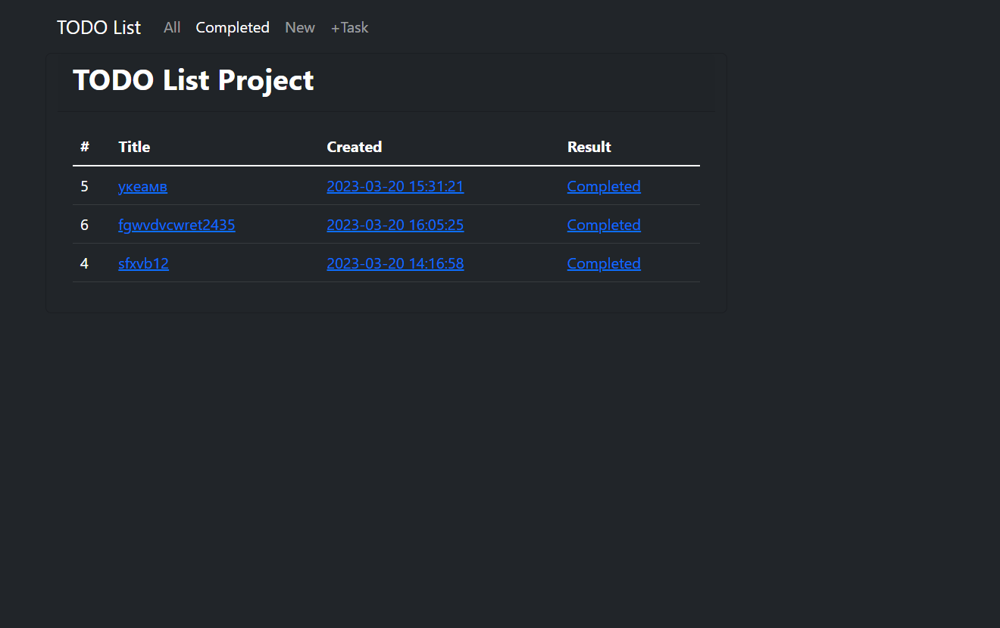
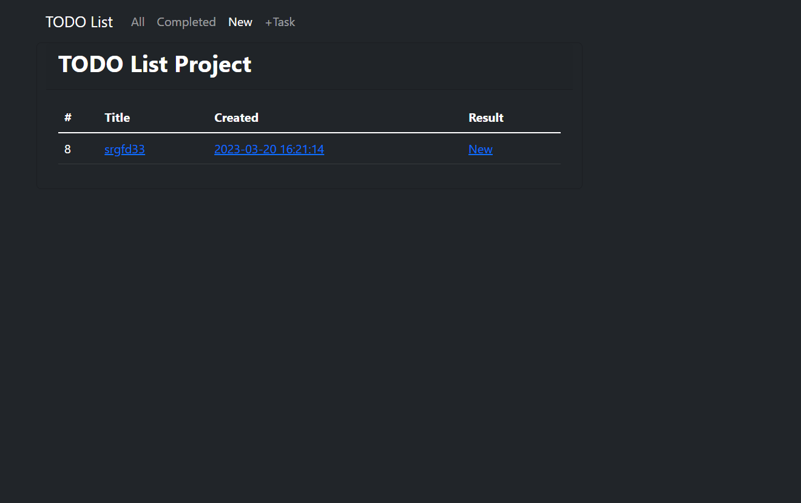
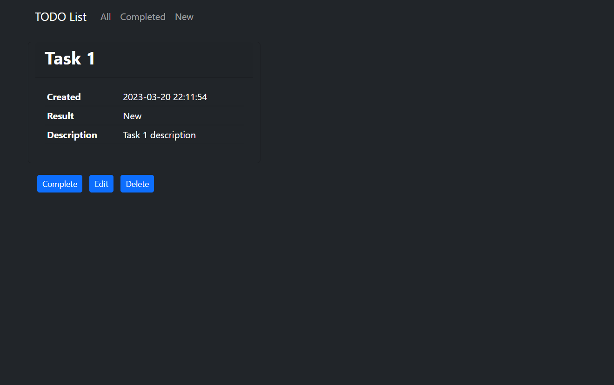
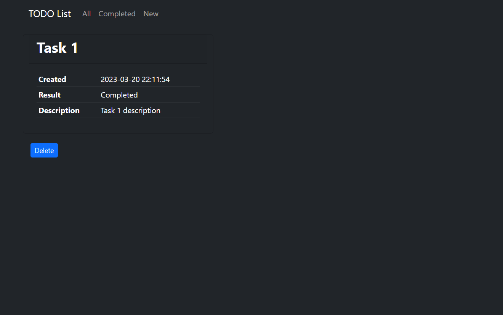
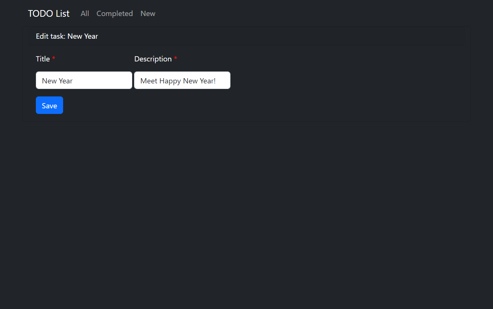
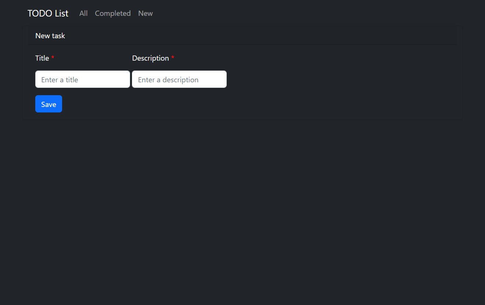

### TODO List Project 
> \- a simple task tracker to create and track tasks.  
The application displays a list of all tasks. Tasks can be created, deleted and edited.

## About the application
+ The application has three layers: Controller, Service, Persistence;
+ On the page with a list of all tasks
  + the table displays the name, creation date and status (completed or not);
  + button for adding task "Add task";
  + three links: All, Completed, New - when translating by links, the table displays: all tasks, only completed or only new ones;
+ Clicking on a task will take you to a page with a detailed description;
+ On the page with a detailed description there are buttons: Done, Edit, Delete;
+ If you click on the "Execute" button, then the task will be transferred to the "Completed" state;
+ Button "Edit" - transfers the user to a separate page for editing;
+ Button "Delete" - deletes the task and goes to the list of all tasks.

## Technology stack:
+ Java 17,
+ Maven 4.0,
+ Hibernate 5,
+ Spring boot 2,
+ PostgreSql 14,
+ Liquibase,
+ SLF4J,
+ Lombok,
+ Thymeleaf 3,
+ Bootstrap 5,.

## Environment requirements:
+ Java 17, 
+ Maven 3.8, 
+ PostgreSQL 14

## Application pages:
+ ### Main page

+ ### All tasks list

+ ### Completed tasks list

+ ### New tasks list

+ ### New task description

+ ### Completed task description

+ ### Edit task

+ ### Add task
